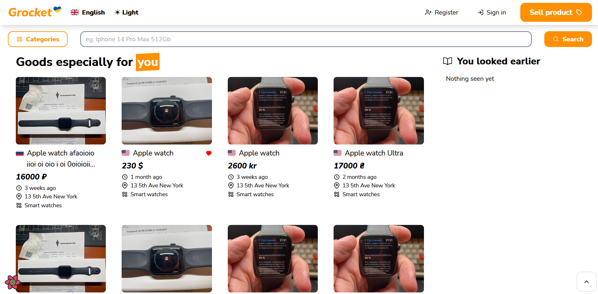

<div align="center">

  
  <h1>Grocket</h1>
  <p>
    Grocket is an international online marketplace that specializes in secondhand items. It provides a platform for users to buy and sell a variety of used goods from all over the world, including clothing, electronics, furniture, and more.
  </p>
  
<!-- Badges -->
<p>
  <a href="https://github.com/alexzawadsky/Grocket/graphs/contributors">
    
  </a>
  <a href="">
    
  </a>
</p>

<h4>
    <a href="https://github.com/Louis3797/awesome-readme-template/">View Demo</a>
  <span> · </span>
    <a href="https://github.com/Louis3797/awesome-readme-template">Documentation</a>
  <span> · </span>
    <a href="https://github.com/Louis3797/awesome-readme-template/issues/">Report Bug</a>
  <span> · </span>
    <a href="https://github.com/Louis3797/awesome-readme-template/issues/">Request Feature</a>
  </h4>
</div>

<br />

<!-- Table of Contents -->
# :notebook_with_decorative_cover: Table of Contents

- [:notebook\_with\_decorative\_cover: Table of Contents](#notebook_with_decorative_cover-table-of-contents)
  - [:star2: About the Project](#star2-about-the-project)
    - [:camera: Screenshots](#camera-screenshots)
    - [:space\_invader: Tech Stack](#space_invader-tech-stack)
    - [:dart: Features](#dart-features)
    - [:art: Color Reference](#art-color-reference)
    - [:key: Environment Variables](#key-environment-variables)
  - [:toolbox: Getting Started](#toolbox-getting-started)
    - [:bangbang: Prerequisites](#bangbang-prerequisites)
    - [:running: Run Locally](#running-run-locally)
      - [Frontend](#frontend)
      - [Backend](#backend)
    - [:triangular\_flag\_on\_post: Deployment in docker](#triangular_flag_on_post-deployment-in-docker)
  - [:handshake: Contact](#handshake-contact)

<!-- About the Project -->
## :star2: About the Project

<!-- Screenshots -->
### :camera: Screenshots

<div align="center">
  
</div>

<!-- TechStack -->
### :space_invader: Tech Stack

<ul>
<li>
<summary>Client</summary>
  <a href="https://reactjs.org/">React.js</a>
    <a href="https://tailwindcss.com/">TailwindCSS</a>
    </li>
<li>
<summary>Server</summary>
    <a href="https://reactjs.org/">React.js</a>
    <a href="https://tailwindcss.com/">TailwindCSS</a>
    </li>
<li>
<summary>Database</summary>
  <a href="https://reactjs.org/">React.js</a>
    <a href="https://tailwindcss.com/">TailwindCSS</a>
    </li>
<li>
<summary>Dev-Ops</summary>
  <a href="https://reactjs.org/">React.js</a>
    <a href="https://tailwindcss.com/">TailwindCSS</a>
    </li>
</ul>

<!-- Features -->
### :dart: Features

- Global
- Feature 2
- Feature 3

<!-- Color Reference -->
### :art: Color Reference

| Color         | Hex                                                              |
| ------------- | ---------------------------------------------------------------- |
| Primary Color |  #FF9001 |

<!-- Env Variables -->
### :key: Environment Variables

To run this project, you will need to add the following environment variables to your .env file.

#### Backend
infra/.env
```
DB_ENGINE=django.db.backends.postgresql
DB_NAME=postgres
POSTGRES_USER=postgres
POSTGRES_PASSWORD=<your password>
DB_HOST=db
DB_PORT=5432
REDIS_HOST=localhost
REDIS_PORT=6379
REDIS_DB=0
```

#### Frontend
frontend/.../.env.deploy
```
DB_ENGINE=django.db.backends.postgresql
DB_NAME=postgres
POSTGRES_USER=postgres
POSTGRES_PASSWORD=<your password>
DB_HOST=db
DB_PORT=5432
```

<!-- Getting Started -->
## :toolbox: Getting Started

<!-- Prerequisites -->
### :bangbang: Prerequisites

This project uses <a href='https://python-poetry.org/docs/'>Poetry</a> as backend package manager

#### Instalation
Linux, macOS, Windows (WSL)
```bash
curl -sSL https://install.python-poetry.org | python3 -
```

Windows (Powershell)
```bash
(Invoke-WebRequest -Uri https://install.python-poetry.org -UseBasicParsing).Content | py -
```

<!-- Run Locally -->
### :running: Run Locally

Clone the project

```bash
git clone https://github.com/alexzawadsky/Grocket.git
```

#### Frontend

Go to the project directory

```bash
cd frontend
```

Install dependencies

```bash
npm install
```

Start the server

```bash
npm run dev
```

#### Backend

Go to the backend directory

```bash
cd backend/
```

Install dependencies

```bash
poetry shell
poetry install
```

Go to the project directory

```bash
cd grocket/
```

Apply migrations

```bash
python manage.py migrate
```

Add dump data to the database

```bash
sh data/json/add.sh
```

OR

```bash
python3 manage.py loaddatautf8 data/json/categories.json
python3 manage.py loaddatautf8 data/json/promotions.json
python3 manage.py loaddatautf8 data/json/statuses.json
```

Start the server

```bash
python manage.py runserver
```

<!-- Deployment -->
### :triangular_flag_on_post: Deployment in docker

Go to the docker-compose directory

```bash
cd infra
```

Start docker with bash script

```bash
sh install.sh
```

Start docker manually
```bash
docker-compose up -d --build
docker-compose exec web python manage.py migrate
docker-compose exec web python manage.py collectstatic
docker-compose exec web python manage.py loaddatautf8 data/json/categories.json
docker-compose exec web python manage.py loaddatautf8 data/json/promotions.json
docker-compose exec web python manage.py loaddatautf8 data/json/statuses.json
```

<!-- Contact -->
## :handshake: Contact

All contact options are available in our profiles, feel free to DM using any option.
